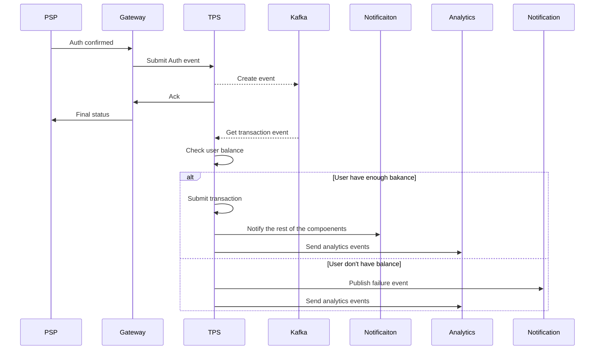

# Transaction Processing System

## Design Key Points
* **Event sourced balance storage**
A checkpoint is created for user balance and balance is calculated throught this log

* **Durable communication**
Using _Listen to yourself_ pattern 

* **Simple immutable ledger**
No update to transaction statuses only addition which is suitable for financial systems

* **Race condition prevention**
Through having a lock on card to prevent another concurrent authorizations

* **Horizontally scalable**
The application is stateless by design

* **Leveraging NestJs design patterns for building decoupled systems**
Through usage of observable pattern for example to decouple authorization handler from event listeners

## ERD

## Sequences
⚠️ **TPS** is the transaction processing serive behind the gateway 
### Authorization

